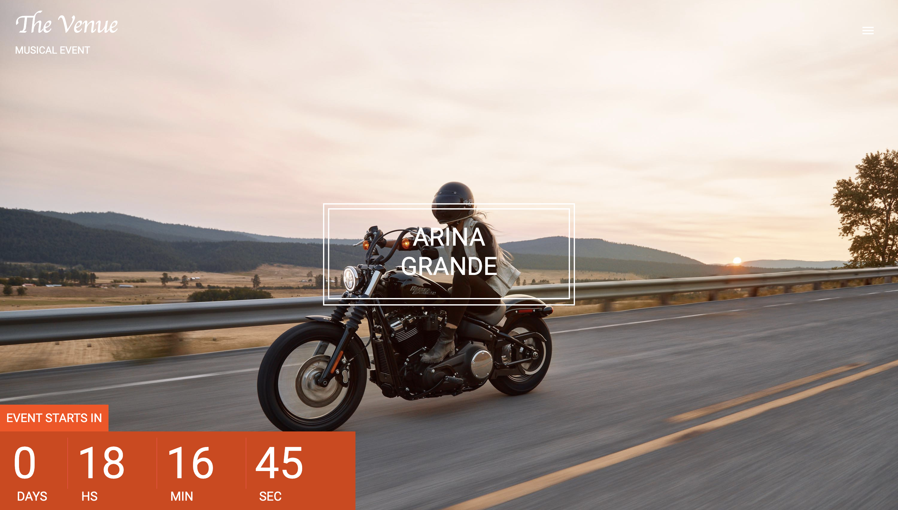
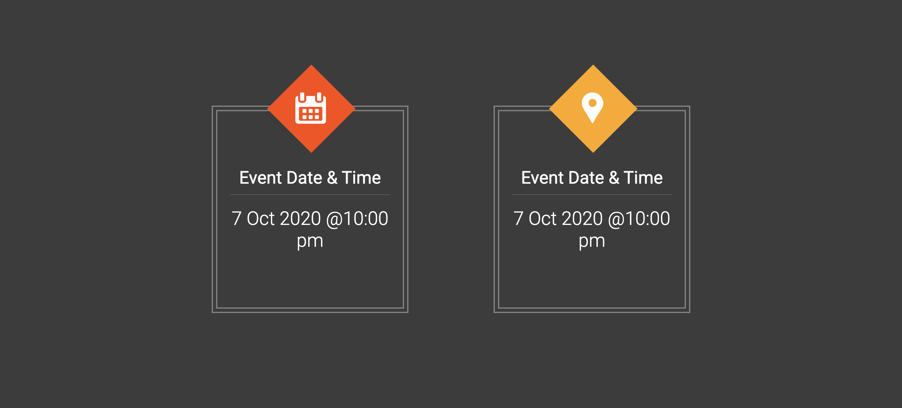
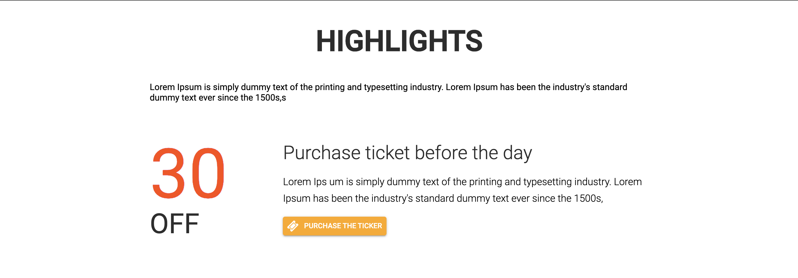
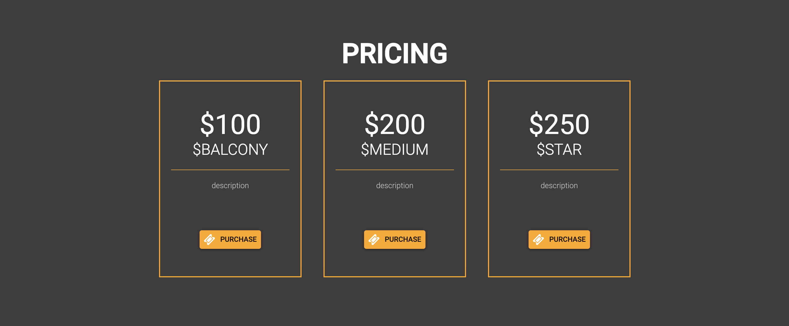
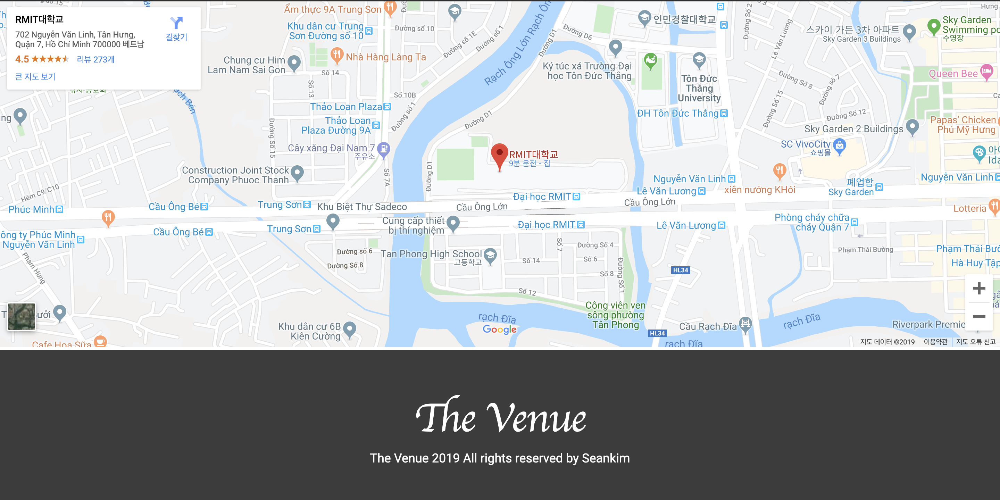

## Venue App with React

### This App Created by React

For practice the Web Design and Motions

#### Landing Page

#### Others

## What I learend ?

1. Change the header background color when user do mouse scroll 
2. Count the D-Day
3. react-reveal / react-scroll 

